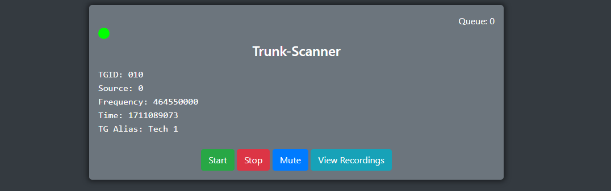

# Trunk Scanner

[](https://www.gnu.org/licenses/gpl-3.0)

# IN ACTIVE DEVELOPMENT

Remotely listen to SDR software and playback recordings.



## Getting started

Install node js

### Install Requirements

`npm i`

### Running Trunk Scanner

If you want to specify your own config file:
```bash
node src/app.js -c configs/config.yml
```

### Configure

Edit the `config.yml` file to your needs NOTE: NOT USED RN

## Todo

A lot