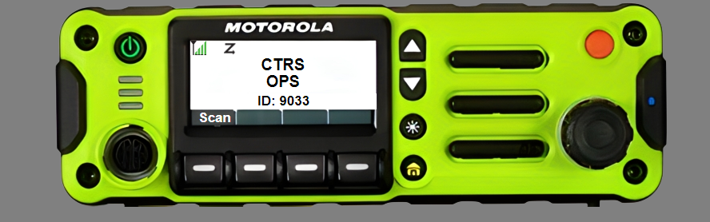

# Trunk Scanner

[](https://www.gnu.org/licenses/gpl-3.0)

Remotely listen to SDR software and playback recordings.

### Simple UI:


### APX Emulator:


The APX emulator requires you to create a codeplug via the Trunk Scanner CPS to use.

## Getting started

Install node js

### Install Requirements

`npm i`

### Configure

Edit `config.yml` file to your needs

You should setup a API in SDR Trunk similar to rdio scanner.

Specify the corresponding info you made in SDR Trunk API in the config file.

The groups in the config file are for the UI whitelists on the standard/default view vs the codeplug defines this for the APX or unication view.

### Running Trunk Scanner

If you want to specify your own config file:
```bash
node app.js -c configs/config.yml
```

### Usage
The default `/` route will show the standard view, `/apxRadio` will show the APX view, and `/unication` will give you the unication view.